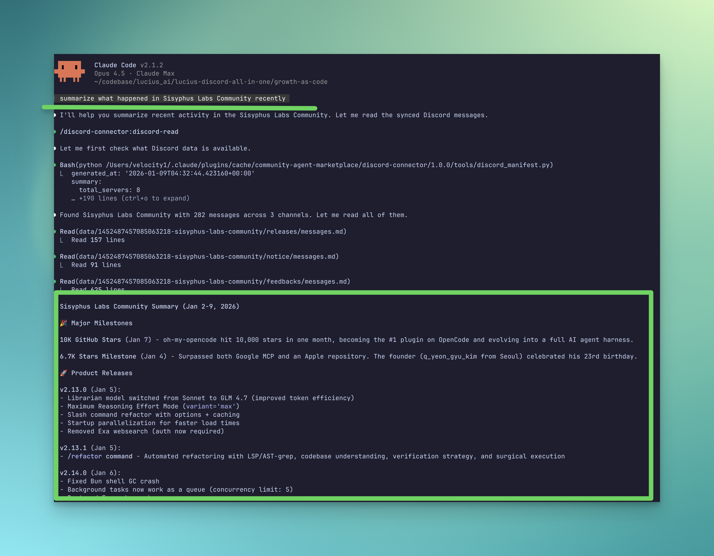
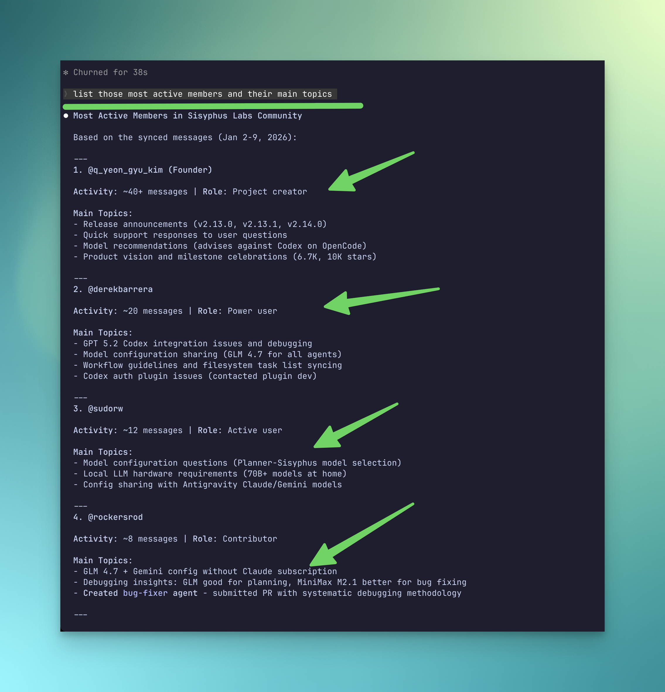

# Community Agent Plugin Marketplace

A Claude Code plugin marketplace for community management tools. Sync and analyze Discord & Telegram messages directly from Claude Code.

## Quick Start

### 1. Install the Plugin

```bash
/plugin marketplace add https://github.com/lycfyi/community-agent-plugin
```

Then select the plugin(s) you want to install from the marketplace.

### 2. Set Up Your First Connector

**For Discord:**
```
"Set up Discord sync for my account"
```

**For Telegram:**
```
"Set up Telegram sync for my account"
```

### 3. Start Using

```
"Sync my Discord messages"
"Summarize what's happening in my community"
"Analyze community health"
```

## Prerequisites

- Claude Code CLI
- Python 3.11+
- Discord account (for discord-connector)
- Telegram account (for telegram-connector)

## Demo

**Summarize discussion topics from a Discord server:**



**Find the most active community members:**



## Architecture

```
┌─────────────────────────────────────────────────────────┐
│                   community-agent                        │
│                   (THE BRAIN)                            │
│                                                          │
│  Orchestrating agent that coordinates cross-platform     │
│  workflows using platform connectors as "hands"          │
└─────────────────────────────────────────────────────────┘
        │                                    │
        ▼                                    ▼
┌───────────────────┐              ┌───────────────────┐
│ discord-connector │              │telegram-connector │
│    (HANDS)        │              │    (HANDS)        │
│                   │              │                   │
│ Platform-specific │              │ Platform-specific │
│ skills for Discord│              │ skills for Telegram│
└───────────────────┘              └───────────────────┘
```

## Available Plugins

| Plugin | Description |
|--------|-------------|
| `community-agent` | Orchestrating agent + shared library. Coordinates cross-platform workflows. |
| `discord-connector` | Skills for syncing, reading, and analyzing Discord messages |
| `telegram-connector` | Skills for syncing, reading, and analyzing Telegram messages |

---

## community-agent

The brain of the system. Provides:

- **community-manager agent** - Coordinates cross-platform workflows
- **community-patterns skill** - Domain knowledge for community management
- **Shared utilities** - Config, storage, formatting used by all connectors

**Example conversations:**
- "Sync all my communities" (coordinates Discord + Telegram)
- "Summarize activity across all platforms"
- "Send announcement to all my communities"

---

## discord-connector

Sync, read, and analyze Discord messages directly from Claude Code.

| Skill                  | Purpose                                            |
| ---------------------- | -------------------------------------------------- |
| `discord-init`         | Initialize configuration from your Discord account |
| `discord-list`         | List accessible servers and channels               |
| `discord-sync`         | Sync messages to local Markdown storage            |
| `discord-read`         | Read and search synced messages                    |
| `discord-send`         | Send messages to Discord channels                  |
| `discord-chat-summary` | AI-powered summary of Discord conversations        |
| `discord-analyze`      | Generate community health reports with metrics     |
| `discord-doctor`       | Diagnose configuration issues                      |

**Example conversations:**

- "Set up Discord sync for my account"
- "Show me all the servers I have access to"
- "Sync the last 7 days of messages from all servers"
- "Summarize what's been happening in XXX Server"
- "Search for messages mentioning 'bug report'"
- "Analyze community health for my Discord server"
- "Draft a self-intro for me and send it to proper discord server and channels"

**Getting your Discord token:**

[How to get your Discord user token (guide)](https://discordhunt.com/articles/how-to-get-discord-user-token)

> **Warning:** Using a user token may violate Discord's Terms of Service. This tool is intended for personal archival and analysis only. Use at your own risk.

---

## telegram-connector

Sync, read, and analyze Telegram messages directly from Claude Code.

| Skill            | Purpose                                      |
| ---------------- | -------------------------------------------- |
| `telegram-init`  | Initialize Telegram connection and config    |
| `telegram-list`  | List accessible groups and forum topics      |
| `telegram-sync`  | Sync messages to local Markdown storage      |
| `telegram-read`  | Read and search synced messages              |
| `telegram-send`  | Send messages to Telegram groups             |
| `telegram-doctor`| Diagnose configuration issues                |

**Example conversations:**

- "Set up Telegram sync for my account"
- "List all my Telegram groups"
- "Sync the last 7 days of messages from my group"
- "Search Telegram messages for 'meeting'"
- "Send a message to my Telegram group"

**Getting your Telegram credentials:**

1. Get API credentials from https://my.telegram.org/apps
2. Generate a session string: `python plugins/telegram-connector/scripts/generate_session.py`
3. Add to `.env`:
   ```
   TELEGRAM_API_ID=your_api_id
   TELEGRAM_API_HASH=your_api_hash
   TELEGRAM_SESSION=your_session_string
   ```

> **Warning:** Using a user token may violate Telegram's Terms of Service. This tool is intended for personal archival and analysis only. Use at your own risk.

---

## Directory Structure

After running any connector, your working directory will have:

```
your-project/
├── .env                           # Your credentials
├── config/
│   └── agents.yaml                # Unified config for all platforms
└── data/                          # Synced messages
    ├── manifest.yaml              # Index of all synced data
    ├── {server_id}-{slug}/        # Discord servers
    │   ├── server.yaml
    │   ├── sync_state.yaml
    │   ├── health-report.md       # Health analysis (if generated)
    │   └── {channel}/
    │       └── messages.md
    └── {group_id}-{slug}/         # Telegram groups
        ├── group.yaml
        ├── sync_state.yaml
        └── messages.md
```

## Plugin Structure

```
plugins/
├── community-agent/         # THE BRAIN
│   ├── agents/
│   │   └── community-manager.md    # Orchestrating agent
│   ├── skills/
│   │   └── community-patterns/     # Domain knowledge
│   └── lib/                        # Shared utilities
│
├── discord-connector/       # HANDS (Discord)
│   ├── skills/              # Platform skills
│   ├── tools/               # Python implementations
│   └── lib/
│
└── telegram-connector/      # HANDS (Telegram)
    ├── skills/              # Platform skills
    ├── tools/               # Python implementations
    └── lib/
```

## License

AGPL-3.0
